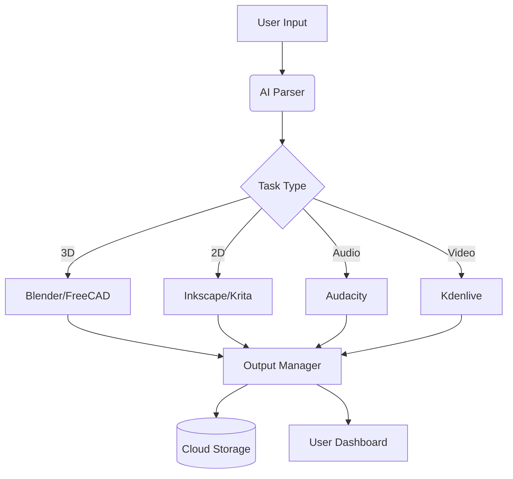

<p align="center">
  
</p>
# 🚀 DesignXHub – Unified AI-Powered Creative Platform

[](https://github.com/DesignXHub/DesignXHub)

---

## 🧾 About the Project

**DesignXHub** is a unified, open-source creative platform powered by AI that allows users to design, model, edit, and generate multimedia content through voice or text commands. It integrates leading open-source tools for every creative field, giving individuals and teams a seamless way to create complete digital projects using natural language.

It is engineered to serve design needs across **all domains of life** — including aerospace, marine, architecture, transportation, health, agriculture, weather systems, industrial automation, education, renewable energy, smart cities, and even space exploration and deep-sea missions.

---

## 👤 Owner

# 🚀 DesignXHub – AI-Powered Creative Workflow Platform

[](https://opensource.org/licenses/MIT)
[](https://www.python.org/)
[](https://www.blender.org/)


## 🌟 About

DesignXHub is an open-source AI orchestration platform that unifies creative tools through natural language commands. Transform ideas into production-ready designs across multiple domains using voice/text inputs.

**Key Innovation:**  
✨ Unified API bridging 15+ open-source creative tools  
✨ AI-generated scripts for Blender, FreeCAD, Krita, etc.  
✨ Enterprise-grade workflow automation

## 🚀 Quick Start

### Prerequisites
- Python 3.10+
- Blender 3.4+ | FreeCAD 0.21+ | Krita 5.2+
- NVIDIA GPU recommended (CUDA 11.8)

### Installation
```bash
git clone https://github.com/DesignXHub/DesignXHub.git
cd DesignXHub
python -m venv .env
source .env/bin/activate
pip install -r requirements.txt
```

### Basic Usage
```python
from designxhub import Orchestrator

# Initialize AI core
engine = Orchestrator()

# Process design command
result = engine.process(
    command="Create parametric gear system with 42 teeth",
    target_tool="FreeCAD",
    export_formats=["STEP", "STL"]
)

print(f"Design saved to: {result['output_path']}")
```

## 🧩 Core Components

### AI Orchestration Stack
| Component | Technology | Function |
|-----------|------------|----------|
| NLP Engine | Mistral-7B | Intent recognition |
| Code Gen | DeepSeek-Coder | Tool-specific scripting |
| Safety Check | CodeQL | Vulnerability scanning |
| Execution | Docker | Sandboxed environments |

### Supported Tools Matrix
| Category | Tools | Input Types | Output Formats |
|----------|-------|-------------|----------------|
| 3D CAD | FreeCAD, OpenSCAD | Text commands | STEP, STL, OBJ |
| 2D Design | Inkscape, Krita | Sketch prompts | SVG, PNG, PDF |
| Audio | Audacity, LMMS | Voice narration | WAV, MP3, MIDI |
| Video | Kdenlive, Shotcut | Storyboard desc | MP4, MOV, GIF |

## 🌐 System Architecture



## 📈 Enterprise Features

### Industry-Specific Solutions
| Sector | Use Cases | Sample Command |
|--------|-----------|----------------|
| Aerospace | Drone design, CFD analysis | "Generate wind-resistant drone frame with 6 rotors" |
| Automotive | Part optimization, Crash simulation | "Improve bumper impact absorption by 40%" |
| Biomedical | Prosthetic modeling, Lab layouts | "Create adjustable prosthetic hand STL file" |
| Energy | Turbine blade design, Solar layouts | "Optimize wind turbine blade for low-wind areas" |

## 🤝 Contributing

We welcome contributions! Please review our:
- [Contribution Guidelines](CONTRIBUTING.md)
- [Code of Conduct](CODE_OF_CONDUCT.md)
- [Roadmap](ROADMAP.md)

### Development Setup
```bash
# Install with test dependencies
pip install -r requirements-dev.txt

# Run verification tests
pytest tests/ --cov=designxhub --cov-report=html
```

## 📜 License
Distributed under MIT License. See `LICENSE` for details.

## 📞 Contact
**Project Lead:** Ammar Alrubayie  
**Email:** erg-ellabban@outlook.com  
**Discord:** [DesignXHub Community](https://discord.gg/your-invite-link)

---

**Empowering Global Innovation Through Open-Source Creativity**  
© 2023 DesignXHub Collective
 
- **Date of Registration:** 2025-05-23


This project is licensed under the GNU GPL v3 – feel free to use, adapt, and contribute with proper credit.
