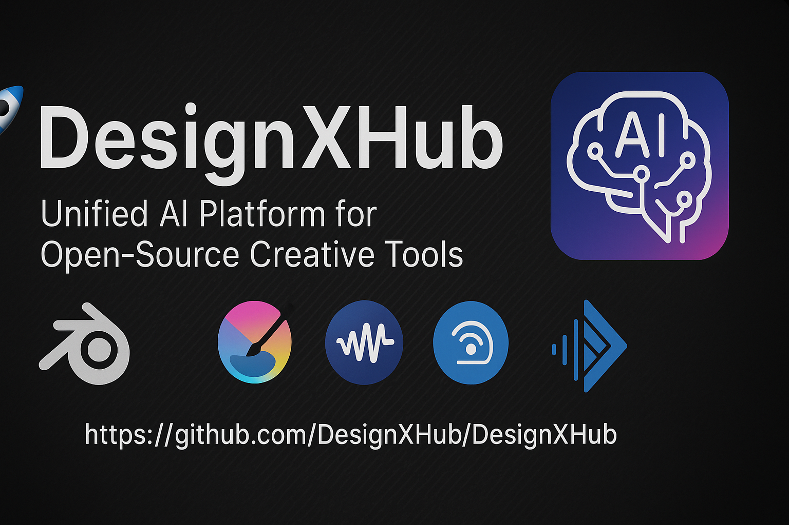

  

# 🚀 DesignXHub – Unified AI-Powered Creative Platform

---

## 🧾 About the Project

**DesignXHub** is a unified, open-source creative platform powered by AI that allows users to design, model, edit, and generate multimedia content through voice or text commands. It integrates leading open-source tools for every creative field, giving individuals and teams a seamless way to create complete digital projects using natural language.

It is engineered to serve design needs across **all domains of life** — including aerospace, marine, architecture, transportation, health, agriculture, weather systems, industrial automation, education, renewable energy, smart cities, and even space exploration and deep-sea missions.

---

## 👤 Owner

- **Name:** Ammar Alrubayie  
- **Email:** erg-Ellabban@outlook.com  
- **Date of Registration:** 2025-05-23

---

## 🎯 Project Goals

- Unify multiple design tools under one AI-driven system.
- Eliminate the need to switch between apps manually.
- Enable creators to design through simple commands.
- Support both beginners and professionals.

---

## 🛠️ Features

### 🎨 2D Design
- Tools: **Krita**, **Inkscape**
- Uses: Drawing, illustrations, digital painting, vector graphics

### 🧱 3D & CAD Modeling
- Tools: **Blender**, **FreeCAD**
- Uses: Product design, modeling, architecture, animation

### 🎧 Audio Editing
- Tool: **Audacity**
- Uses: Sound editing, podcast creation, audio cleanup

### 🎬 Video Editing
- Tool: **Kdenlive**
- Uses: Video montage, cutting, effects, export

### 🧠 AI Command Parsing
- Tools: **GPT4All**, **Whisper**
- Uses: Understand text and voice commands and turn them into creative output

---

## 🌐 System Architecture

- 🎙️ **Input Layer**: Accepts either text or voice commands  
- 🔍 **AI Engine**: Uses GPT models to understand intent  
- 🎨 **Execution Layer**: Routes commands to relevant design software (via APIs/Scripting)  
- 📤 **Output**: Returns rendered design, audio/video, or 3D model  

---

## 🌍 Domains Served (Across Life & Nature)

| Field                    | Applications                                                  |
|-------------------------|---------------------------------------------------------------|
| Agriculture            | Greenhouse layouts, irrigation systems, soil sensors design    |
| Weather & Climate      | Meteorological modeling, data visualization, UI dashboards     |
| Environmental Systems  | Pollution mapping, recycling workflows, sustainability design  |
| Aerospace               | Drone bodies, satellite parts, flight system layouts           |
| Marine Engineering      | Hulls, sonar modules, underwater drones                        |
| Architecture            | Urban models, smart city layouts, green buildings              |
| Mechanical Engineering  | Machinery, automation systems, robots                          |
| Electronics             | PCB layout, schematics, device enclosures                      |
| Automotive              | Chassis, dashboards, custom parts                              |
| Renewable Energy        | Wind turbine parts, solar mountings                            |
| Education               | Learning simulations, interactive training content             |
| Biomedical              | Prosthetics, lab layouts, medical tool design                  |
| Space Exploration       | Surface rovers, telescopic assemblies, pressure-sealed units   |
| Subsea Research         | Pressure vessels, submersibles, ROV tooling                    |

---

## 💡 Vision

> “A world where design begins with an idea, and ends in reality — without knowing how to code or use complex tools.”

---

## 📦 Technologies Used

| Domain       | Tools                |
|--------------|----------------------|
| AI Parsing   | GPT4All, Whisper     |
| 2D Graphics  | Krita, Inkscape      |
| 3D Modeling  | Blender, FreeCAD     |
| Audio        | Audacity             |
| Video        | Kdenlive             |
| Language     | Python               |

---

## 🚧 Roadmap

- [x] Project Initialization  
- [x] GitHub Repository Setup  
- [x] Initial 3-Tool Integration  
- [ ] Full AI Voice Command Flow  
- [ ] Frontend Interface (Web-based)  
- [ ] Package Manager Support  
- [ ] Deployment with Installers  

---

## 📝 How to Use (coming soon)

Instructions for:
- Installing dependencies
- Running the controller
- Giving commands (voice/text)
- Exporting designs

---

## 🤝 Contributions

We welcome contributions! Whether it's fixing bugs, improving documentation, or suggesting features — your input is valuable.

---

## 📜 License

This project is licensed under the GNU GPL v3 – feel free to use, adapt, and contribute with proper credit.
